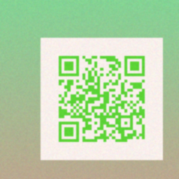
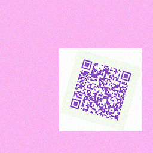
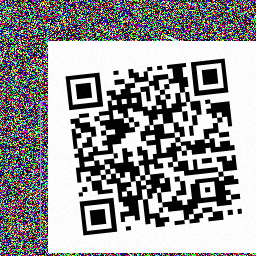

# Building a QR Code Detector and Decoder with TensorFlow

[← Back to Home](./index.md)

## Table of Contents
1. [Data Generation](#1-data-generation)
2. [Model Architecture](#2-model-architecture)
3. [Training Pipeline](#3-training-pipeline)
4. [Inference and Decoding (Static Images)](#4-inference-and-decoding-static-images)
5. [Decoding QR Codes from GIFs](#5-decoding-qr-codes-from-gifs)
6. [Results and Observations](#6-results-and-observations)
7. [Results Gallery](#7-results-gallery)
8. [Tips for Robustness](#8-tips-for-robustness)
9. [Try It Yourself](#9-try-it-yourself)
10. [References](#10-references)
11. [Appendix: Publish as a GitHub Pages Site](#appendix-publish-as-a-github-pages-site)

---

This post walks through how we:
- Generated a large synthetic dataset of QR and non-QR images
- Trained a TensorFlow model to detect QR presence
- Decoded QR codes (including from animated GIFs) using OpenCV
- Applied multiple strategies to robustly decode difficult GIF QR codes

The full project lives in this workspace. Key scripts:
- `src/generate_qr.py`: QR generator with color, transparency, and background styles
- `src/generate_non_qr.py`: Non-QR negative sample generator
- `src/prepare_dataset.py`: Train/val split script
- `src/model.py`: CNN architecture
- `src/train.py`: Training pipeline
- `src/infer_and_decode.py`: Image-level detection + decoding
- `src/infer_gif.py`: GIF cumulative overlays + detection/decoding
- `src/decode_animated_qr.py`: Multi-strategy GIF QR decoder

## 1. Data Generation

We generated QR and non-QR images to build a robust binary classifier (QR vs non-QR).

- QR styles:
  - Gradient backgrounds with colored QR and alpha
  - Solid color backgrounds with colored QR
  - Noisy backgrounds with classic B/W QR

Example commands:
```zsh
# Colored + gradient background QR
python3 src/generate_qr.py --out data/raw/qr_gradient --count 4000 --size 256 --colored --bg-mode gradient --alpha-min 0.4 --alpha-max 0.9

# Colored + solid background QR
python3 src/generate_qr.py --out data/raw/qr_solid --count 3000 --size 256 --colored --bg-mode solid

# Classic QR on noisy background
python3 src/generate_qr.py --out data/raw/qr_noisy --count 3000 --size 256 --bg-mode noisy

# Non-QR negatives
python3 src/generate_non_qr.py --out data/raw/non_qr --count 10000 --size 256
```

Merge mixed QR styles and split:
```zsh
mkdir -p data/raw/qr
cp data/raw/qr_gradient/*.png data/raw/qr/
cp data/raw/qr_solid/*.png data/raw/qr/
cp data/raw/qr_noisy/*.png data/raw/qr/

python3 src/prepare_dataset.py --raw-dir data/raw --out-dir data/dataset --val-ratio 0.2
```

Example outputs:


Caption: Colored QR with semi-transparent modules over a vertical gradient.


Caption: Colored QR rendered on a solid pastel background.


Caption: Classic black/white QR composited onto a noisy textured background.

## 2. Model Architecture

We used a compact CNN classifier (`src/model.py`) over 128x128 grayscale inputs:
- Rescaling + light augmentation
- 3 conv blocks with BatchNorm and MaxPool
- GlobalAveragePooling + dense layers
- Sigmoid output for QR presence

Trainable parameters: ~615K.

## 3. Training Pipeline

Training loads `data/dataset/{train,val}/{qr,non_qr}` via `image_dataset_from_directory`, converts to grayscale, and trains with early stopping and checkpointing.

```zsh
python3 src/train.py --data-dir data/dataset --img-size 128 --batch-size 128 --epochs 15 --model-dir models
```

Artifacts:
- Best checkpoint: `models/qr_classifier.h5`
- Keras SavedModel: `models/qr_classifier_savedmodel.keras`

## 4. Inference and Decoding (Static Images)

For a static image, we first run the classifier to check if it likely contains a QR. If yes, we attempt to decode using OpenCV's `QRCodeDetector`.

```zsh
python3 src/infer_and_decode.py --image path/to/image.png --model models/qr_classifier.h5 --threshold 0.5
```

If decoding succeeds, you'll see the QR payload printed.

## 5. Decoding QR Codes from GIFs

Animated GIFs can be tricky. We implemented two tools:

### 5.1 Cumulative Overlay and Decode
`src/infer_gif.py` can:
- Extract frames
- Overlay frames cumulatively (1..n) or overlay all frames
- Run detection and decode with OpenCV
- Save overlays to `tmp_cumulative_overlays/` for inspection

```zsh
# Cumulative overlays: save images, run detection and decode
python3 src/infer_gif.py --gif ~/Desktop/qrgif.gif --model models/qr_classifier.h5 --threshold 0.5 --overlay-mode cumulative --blend-mode average
```

Example cumulative overlays (frames 1 and 1..50):


Caption: Single-frame overlay (first frame) — sharpest modules.


Caption: Cumulative overlay 1..50 — reduced noise but softened edges.

### 5.2 Multi-Strategy Animated Decoder
`src/decode_animated_qr.py` implements 5 strategies and exits immediately upon first successful decode:

- Strategy 1: Individual frames
- Strategy 2: Enhanced frames (binary/otsu/adaptive thresholds, sharpening, contrast, denoise)
- Strategy 3: Cumulative overlays (average/max/median) + enhancements
- Strategy 4: Sliding window overlays
- Strategy 5: Frame differences

Run:
```zsh
python3 src/decode_animated_qr.py --gif ~/Desktop/qrgif.gif --save-debug
```

Debug images are saved to `qr_decode_debug/` to help understand which approach worked.

## 6. Results and Observations

- The classifier confidently detects QR presence across diverse styles (colored, transparency, backgrounds).
- Decoding reliability depends on clarity and contrast; cumulative overlays can blur modules, so enhancements (thresholding, sharpening) often help.
- For animated GIF QR codes, trying multiple strategies increases the chance of decoding:
  - Individual frames may already contain a clean QR frame.
  - Otsu/adaptive thresholding frequently recovers sufficient contrast.
  - Sliding window overlays offer a good trade-off between noise reduction and sharpness.

## 7. Results Gallery

Below are decoded outputs from our test samples:

**Gradient Background QR:**
- Image: `qr_gradient_sample.png`
- Detection probability: 1.0000
- Decoded: `74055288-cb33-4fe9-9bec-fdd6fc9ebd97`

**Solid Background QR:**
- Image: `qr_solid_sample.png`
- Detection probability: 1.0000
- Decoded: *(QR detected but OpenCV couldn't extract data — likely high transparency or color contrast issue)*

**Noisy Background QR:**
- Image: `qr_noisy_sample.png`
- Detection probability: 1.0000
- Decoded: `IwJurj8TZsKpketN5vICdibE5`

All samples were correctly identified as containing QR codes. Decoding success varies with contrast and module clarity.

## 8. Tips for Robustness

- Increase dataset diversity: scale, rotation, noise, blur, colors, backgrounds.
- Use more augmentation during training.
- Consider adding a segmentation or object-detection model to localize the QR region before decoding.
- For heavily animated GIFs, export frames and inspect overlays manually (we save them for you).

## 9. Try It Yourself

1. Create venv and install deps:
```zsh
python3 -m venv .venv
source .venv/bin/activate
pip install -r requirements.txt
```

2. Generate data (as above), prepare dataset, and train.
3. Run inference on images and GIFs using the commands provided.

## 10. References
